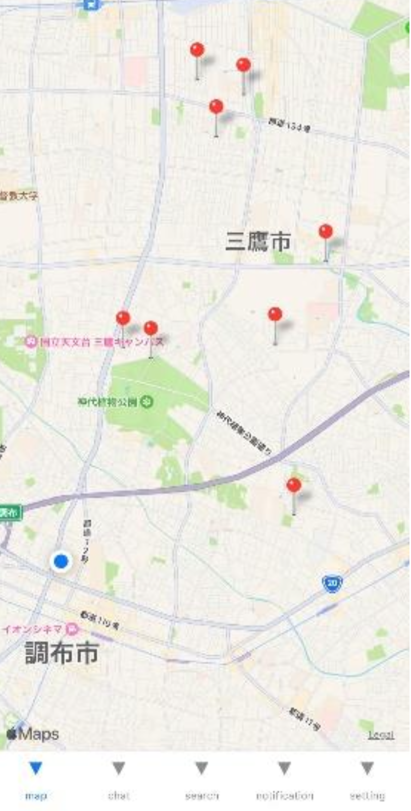

# Dongle 📍

位置情報でつながるリアルタイム SNS
## 📸 アプリケーションスクリーンショット

<div align="center">

### 地図ビュー


### チャット機能


</div>

## ⭐️ 主な機能

- 📱 **位置情報ベースのマッチング**

  - 近くにいるユーザーをリアルタイムで発見
  - 周辺のアクティブなユーザーを地図上で可視化

- 💬 **チャットコミュニケーション**

  - プライベート/パブリックチャットルーム
  - 1 対 1 のダイレクトメッセージ
  - メッセージ既読/未読管理

- 👤 **プロフィール管理**
  - ユーザー情報の編集
  - 自己紹介文の設定
  - アクティビティ履歴の表示

## 🛠 技術スタック

- **フロントエンド**

  - React Native / Expo
  - React Native Maps

- **バックエンド**
  - Firebase Authentication
  - Firestore
  - Geohashing for location queries

## 💻 開発環境のセットアップ

### 必要条件

- Node.js v20.0.0
- npm v8.19.4
- Expo CLI
- iOS/Android シミュレータ

### インストール手順

1. 依存関係のインストール:

```bash
npm install
```

2. 開発サーバーの起動:

```bash
npx expo start
```

3. Expo Go アプリで以下のいずれかを実行:

- iOS シミュレータで実行: `i`を押す
- Android エミュレータで実行: `a`を押す
- QR コードをスキャンしてデバイスで実行

## 📱 アプリケーション構造

```
Dongle/
├── app/               # メインアプリケーションコード
│   ├── auth/         # 認証関連画面
│   └── main/         # メイン機能画面
├── components/        # 再利用可能なコンポーネント
├── api/              # APIクライアント
├── assets/           # 画像などの静的ファイル
└── firebase.js       # Firebase設定
```

## 🔒 セキュリティ設定

- Firebase Configuration の環境変数設定が必要です
- `firebase.js`に適切な認証情報を設定してください
